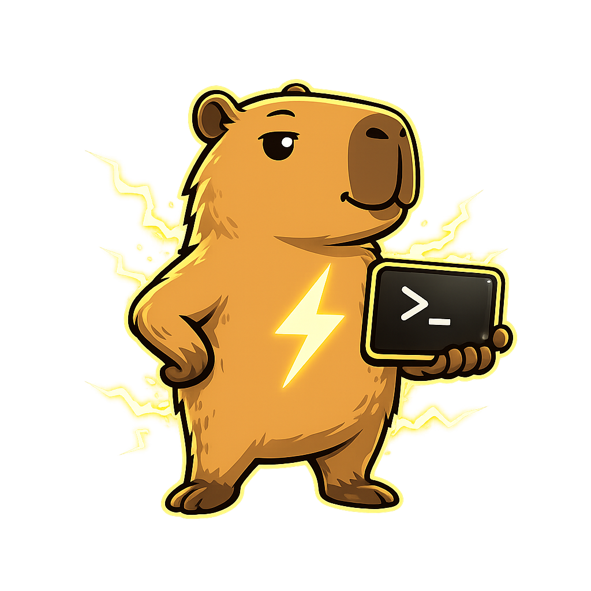

<table>
<tr>
<td width="200" align="center">
  
</td>
<td>

# Agent Session Protocol

The Agent Session Protocol is a portable JSONL format for agentic coding sessions.
It comes with a reference CLI tool (`capi`) for sharing, importing, and tracking sessions across machines and agents.

Sessions can be shared from any agent and resumed by any agent, on any machine.
Works with **Claude Code** and **Codex** today and can be extended with other coding agents.

</td>
</tr>
</table>

## What's in the box

| | |
|---|---|
| **Library** | `import { normalize, denormalize } from "agent-session-protocol"` — convert between each agent's native session format and a common event schema. |
| **`capi` CLI** | `capi export` / `capi import` for ad-hoc session sharing via a Durable Stream; `capi init` / `checkin` / `push` / `resume` / `merge` for a git-integrated team workflow where sessions travel with the code. |
| **`/share` skill** | Installs into Claude Code and Codex so a single slash-command inside the agent publishes the current session. |
| **Live collaboration** | Viewers can submit prompts from the browser via an MCP channel (`capi-queue-channel`); the agent picks them up and responds automatically. |

## Install

```bash
npm install -g agent-session-protocol
# Installs both:
#   capi                  (CLI)
#   capi-queue-channel    (live-collab MCP, wired up by `capi install-channel`)
```

Or import the library into your own code without the CLI:

```bash
npm install agent-session-protocol
```

## Quick start (CLI)

```bash
# One-time: install the /share skill into your agents
capi install-skills --global

# Point capi at a Durable Streams server
export CAPI_SERVER=https://your-ds-server/
export CAPI_TOKEN=<your-token>

# From within a running Claude Code or Codex session, share it:
#   /share            → snapshot share (stable short URL)
#   /share live       → live share, prompts update the URL in real-time

# Or from the command line, against any local session:
capi export --session <id>

# Resume a shared session on another machine, in any agent:
capi import <short-url> --agent codex --resume
```

### Live collaboration (Claude Code only, research preview)

```bash
# One-time setup
capi install-channel
# Then start Claude with:
claude --dangerously-load-development-channels server:queue
```

After `/share live`, the browser viewer shows an input box; prompts typed there arrive in your Claude session via an MCP channel and Claude responds automatically — no keyboard interaction.

### Git-integrated team workflow

```bash
cd your-repo
capi init --server $CAPI_SERVER --token $CAPI_TOKEN --agent claude
capi install-hooks                 # pre-commit hook: pushes session deltas
capi checkin                       # register the current session
# …commit as usual; your sessions track your commits.
# A teammate can later:
capi resume <session-id>           # restores session at the latest commit
capi resume <session-id> --at <sha>  # time-travel to any commit
```

## Quick start (library)

```ts
import { readFileSync } from "node:fs"
import { normalize, denormalize, filterSkillInvocations } from "agent-session-protocol"

// Claude Code JSONL → normalized events
const jsonl = readFileSync("/path/to/claude/session.jsonl", "utf-8")
const lines = jsonl.split("\n").filter(Boolean)

// Strip /share plumbing (optional)
const clean = filterSkillInvocations(lines, "claude")

const events = normalize(clean, "claude")
// events: [{ type: "session_init", ... }, { type: "user_message", ... }, ...]

// Round-trip into Codex's native rollout format
const rolloutLines = denormalize(events, "codex", {
  sessionId: crypto.randomUUID(),
  cwd: "/your/workspace",
})
```

Other exports:

- **`discoverSessions(agent)`** — list local sessions from `~/.claude/sessions/` or `~/.codex/sessions/`.
- **`findClaudeSession(sessionId)`** / **`writeClaudeSession(id, cwd, lines)`** / **`writeCodexSession(id, lines)`** — filesystem helpers.
- **`rewriteNativeLines(lines, agent, mapping)`** — string-level rewrites for lossless same-agent resume without going through the normalized format.
- **`SkillInvocationFilter`** — stateful version of `filterSkillInvocations` for live/streaming use (spans batches).

Event types (re-exported from the package root): `SessionInitEvent`, `UserMessageEvent`, `AssistantMessageEvent`, `ThinkingEvent`, `ToolCallEvent`, `ToolResultEvent`, `TurnCompleteEvent`, `TurnAbortedEvent`, `CompactionEvent`, `ErrorEvent`, `SessionEndEvent`, `PermissionRequestEvent`, `PermissionResponseEvent`.

## Repository layout

```
.
├── src/                   # published library + CLI source
│   ├── index.ts, types.ts, normalize/, denormalize/, sessions.ts, …
│   └── capi/              # CLI implementation (cli.ts, queue-channel.ts, …)
├── bin/                   # capi + capi-queue-channel shims
├── skills/                # /share and /checkin skills
├── test/                  # library tests + capi e2e tests
│
└── viewer/                # separate package — not published to npm
    ├── src/worker.ts      # Cloudflare Worker (short-URL API + SPA host)
    ├── spa/               # React viewer SPA
    └── wrangler.template.toml
```

## The viewer

`viewer/` is a Cloudflare Worker + React SPA that serves the browser-side viewer for shared sessions (and the short-URL backend used by `capi export --shortener`). It's **not** published to npm — deploy it to your own Cloudflare account if you want a self-hosted share URL like `share.yourdomain.com/<shortId>`.

```bash
cd viewer
pnpm install
# One-time: create the KV namespace and record the ID
wrangler kv namespace create SHORTENER_KV
export VIEWER_KV_NAMESPACE_ID=<id-from-above>
export VIEWER_DOMAIN=share.yourdomain.com  # optional

pnpm deploy-worker
```

The worker's `wrangler.toml` is generated from `wrangler.template.toml` at deploy time so no account-specific values are committed.

## How it works

Agent coding tools each persist their sessions as append-only JSONL files. This package:

1. **Normalizes** both formats into a common event stream — `session_init`, `user_message`, `assistant_message`, `thinking`, `tool_call`, `tool_result`, `turn_complete`, `compaction`, `session_end` — preserving the full semantic content of the conversation.
2. **Stores** that stream as a [Durable Stream](https://docs.electric-sql.com/ds): an append-only log with HTTP read/write, SSE live-tailing, and idempotent writes. Shares are URLs to streams.
3. **Denormalizes** back into whichever target agent a reader wants to resume in. Same-agent resume is **lossless** (uses a native sidecar stream). Cross-agent resume uses the normalized stream — semantically equivalent, with generically represented tool calls.

## Adding support for a new agent

Agent integration has three required extension points and two optional ones. Everything else (transport, URL layout, CLI flow, viewer) stays agent-agnostic, so a new-agent PR typically touches 4–5 files.

**Required:**

1. **Declare the agent.** Add its identifier to the `AgentType` union in [`src/types.ts`](src/types.ts).
2. **Write a normalizer** at `src/normalize/<agent>.ts` exporting `normalize<Agent>(lines, options)` that parses the agent's native JSONL and emits `NormalizedEvent[]`. Register it in the `switch` in [`src/index.ts`](src/index.ts)'s `normalize()`.
3. **Write a denormalizer** at `src/denormalize/<agent>.ts` exporting `denormalize<Agent>(events, options)` that produces the agent's native JSONL lines. Register it in `denormalize()` in the same file.
4. **Session discovery** in [`src/sessions.ts`](src/sessions.ts): add `discover<Agent>Sessions()` and `write<Agent>Session(id, lines)`. These tell `capi` how to locate local sessions and where to write new ones during `import --resume`. Wire them into `discoverSessions()` / `findSessionPath()`.

**Optional:**

5. **Tool-name mapping** in [`src/tools.ts`](src/tools.ts) — if the new agent uses different native names for common tools (e.g. `read_file` vs. `Read`), extend `normalizeToolName()` / `denormalizeToolName()` so cross-agent resume sees stable canonical names (`read_file`, `write_file`, `run_bash`, `search`, …).
6. **Skill-invocation filtering** in [`src/filter-skill-invocations.ts`](src/filter-skill-invocations.ts) — if the new agent emits verbose skill/slash-command bookkeeping that shouldn't surface in shared sessions, add `is<Agent>SkillInvocation()` / `is<Agent>SkillMachinery()` detectors.

### Reference implementations

`claude` and `codex` are full worked examples — start from whichever is closer in spirit to the new agent's session format:

| | Claude Code | Codex |
|---|---|---|
| Normalize | [`src/normalize/claude.ts`](src/normalize/claude.ts) | [`src/normalize/codex.ts`](src/normalize/codex.ts) |
| Denormalize | [`src/denormalize/claude.ts`](src/denormalize/claude.ts) | [`src/denormalize/codex.ts`](src/denormalize/codex.ts) |
| Discover / write | `discoverClaudeSessions` / `writeClaudeSession` in `sessions.ts` | `discoverCodexSessions` / `writeCodexSession` |
| Tool mapping | entries in `tools.ts` keyed on `"claude"` | entries keyed on `"codex"` |

Tests live under [`test/normalize/`](test/normalize/), [`test/denormalize/`](test/denormalize/), and [`test/fixtures/`](test/fixtures/). For a new agent, add a representative native JSONL to `test/fixtures/` and round-trip tests mirroring the existing ones.

## License

Apache-2.0
